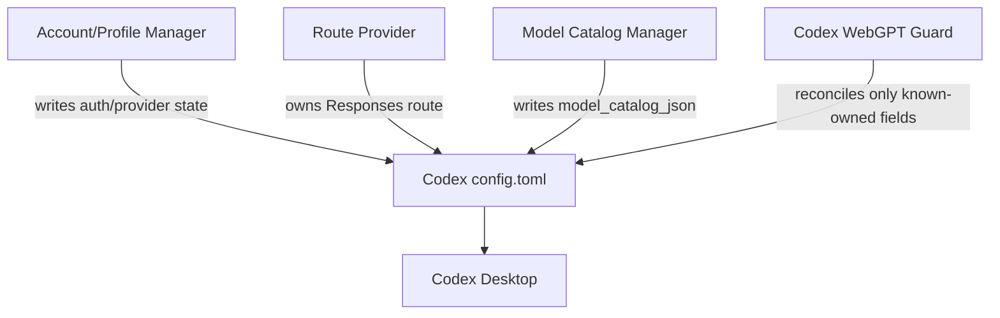
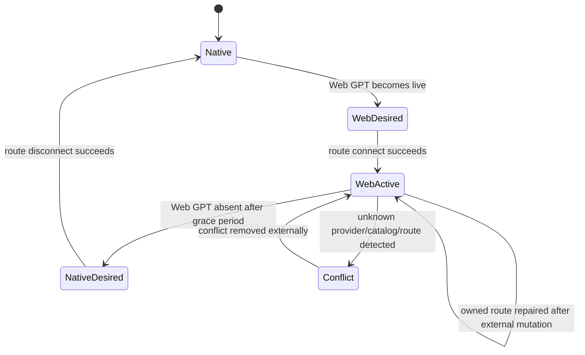

# Architecture

## Design goal

Codex WebGPT Guard is a local reconciliation layer for a shared configuration surface. Its job is not to become another router. Its job is to keep independently managed Codex integrations from accidentally invalidating each other.

The core design principle is:

> Reconcile known ownership; refuse unknown ownership.

## Control-plane model

`~/.codex/config.toml` acts as a shared control plane for several independent concerns:

- authentication/profile state;
- Responses API routing;
- model-provider selection;
- model catalog selection;
- hooks and integration metadata;
- native Codex fallback state.

Those concerns can be managed by different programs with no shared transaction boundary.



## Ownership sources

The Guard does not infer Web GPT ownership from a port number.

For `codex-chatgpt-web`, ownership comes from its own integration journal. The journal records:

- whether the integration is active;
- the Codex config path;
- the installed `openai_base_url`;
- previous state required for restoration.

This is stronger than guessing from current config contents because the current config may already have been modified by another tool.

## Reconciliation loop

The Guard runs as a single per-user daemon.

At a high level:

1. read Guard mode;
2. refresh route-owner journal state;
3. detect Web GPT runtime presence/health;
4. decide desired state: Web or native;
5. use route-owner lifecycle for connect/disconnect;
6. while Web state is active, watch Codex config for conflicting mutations;
7. repair only fields with proven ownership;
8. report and preserve unknown ownership.



## Lifecycle-aware switching

Blindly editing `openai_base_url` is not enough when the route owner maintains a journal, hooks, realtime endpoint state, or caches.

For supported transitions the Guard invokes the route owner's own lifecycle:

```text
codex-chatgpt-web route connect
codex-chatgpt-web route disconnect
```

That allows the owner to keep its internal restore state coherent.

Direct config repair is reserved for the narrow case where an external tool has changed a field the active route owner already owns.

## Ownership conflict rules

The Guard currently treats these as conflicts rather than overwrite targets:

- non-`openai` `model_provider` values it does not own;
- unknown `model_catalog_json` values;
- custom non-official `openai_base_url` values that differ from the Web GPT route.

Known Cockpit-managed model catalogs are an exception because their ownership is known and they can directly replace the Web GPT catalog during account projection.

## Launch-race handling

A subtle failure can happen even when the final config is correct:

```text
T0  external tool rewrites config
T1  Codex starts and reads native/stale route
T2  Guard repairs route
T3  config is correct, but running Codex still has stale startup state
```

The Guard therefore correlates recovery with the config write time.

The Windows recovery path:

- considers only very recently started `ChatGPT`/`Codex` processes;
- correlates start time with the triggering config write;
- resolves the matching application family;
- stops only that fresh matching family;
- restarts the same family through the Windows AppsFolder entry;
- never intentionally terminates older sessions.

## Atomicity

Config changes are written through a temporary file and replaced atomically on Windows.

## Single-instance behavior

A named Windows mutex prevents multiple Guard daemons from racing with each other.

## Failure model

The Guard prefers safe non-action over speculative takeover.

Examples:

- unknown provider -> conflict, no overwrite;
- unknown catalog -> conflict, no overwrite;
- route-owner journal missing -> do not invent route state;
- non-loopback Web GPT route -> reject;
- invalid launcher descriptor -> reject;
- launch recovery cannot prove fresh matching family -> do nothing.
